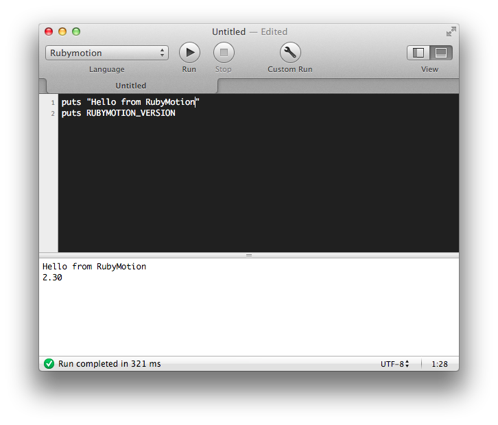

# What is this

This is a small ruby script that let's you run Rubymotion scripts in the popular app [CodeRunner](http://krillapps.com/coderunner/).

It is very useful to quickly test some piece of code using a new Cocoa framework that you're learning or to try to reproduce a bug that you're experiencing.

The script runs as an OSX app, so you cannot load iOS-specific frameworks. However, OSX and iOS share a lot of frameworks that you can use.

# How to install

1. Clone this repository somewhere in your Mac.

2. Open CodeRunner. Go to the  "Languages" tab inside Preferences.

3. Add a new language called Rubymotion. Set syntax mode to Ruby and file extension to ".rb"

4. Mark the "Language uses compilation script" checkbox and click "Edit Script..."

5. A new file will open. Replace its contents with the following line. The path is the local path to the `motion-coderunner.rb` file in your Mac.

  ruby "/Users/mark/src/motion-coderunner/motion-coderunner.rb" "$@"

6. Add `$compiler` into "Run Command:".

7. Create a new CodeRunner file, set the language to Rubymotion, and write some code.

# Extra frameworks

By default, the script will link agaisnt a set of default frameworks. However, you can click the "Custom Run" button, and add more frameworks by writing their names (space separated) in the "Compilation Flags" field.
